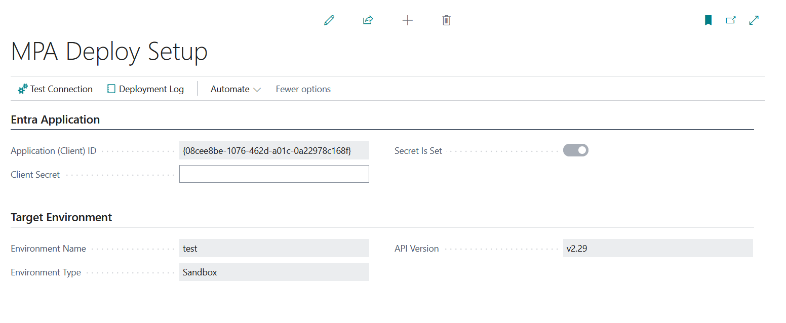
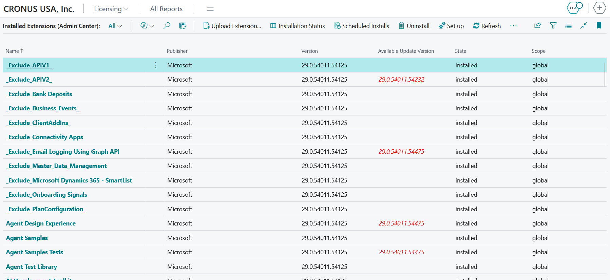
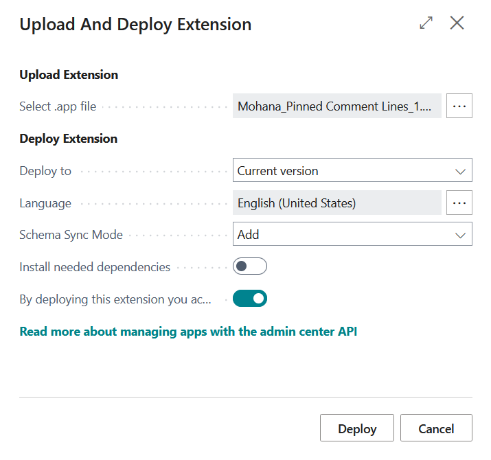

# PTE Extension Management

An AL extension that keeps per-tenant extension management available from inside Business Central after Microsoft removes the Extension Management upload flow.

It gives you a list of the extensions installed on the current environment, plus upload, uninstall, status, and logging - all driven by the Business Central **admin center API** instead of the deprecated platform surface.

## Why this exists

Microsoft has deprecated two things at once: the in-product upload flow on the Extension Management page, and the Automation API `extensionUpload` endpoint. Both are planned for removal in 2027 release wave 1 (version 30). The Extension Management page is expected to survive only as a read-only view of installed extensions.

Because both the UI path and the service path are going, wrapping `codeunit 2504 "Extension Management"` in your own page is not a fix. That method sits on the same platform surface being closed. This app takes the other route instead: it calls the Business Central admin center API, which is the supported replacement, from AL.

## Read this before you install it

This app puts environment-admin credentials inside the environment. Anyone who can open the pages can push code into the tenant without ever having admin center access. That is the exact gap Microsoft is closing, and reopening it is a deliberate decision, not a side effect.

Mitigations that are built in:

- The client secret lives in Isolated Storage at module scope, encrypted. It is never stored in a table field and cannot be read back through the UI.
- Every upload and uninstall attempt is written to the deploy log with the user, subject, environment, HTTP status, operation ID, and full response body.
- The permission set **MPA Deploy Admin** is standalone and is not folded into any Microsoft permission set. Assigning it has to be a conscious act.
- Destructive options are confirmed by name: deleting extension data names the extension and the environment.
- The app cannot uninstall itself, and it warns you when the package you upload is an upgrade of itself.

If those trade-offs do not sit right for a given customer, use the admin center or a build pipeline instead.

## Setup

1. Register an application in Microsoft Entra ID and add a client secret.
2. Grant the application access to the Business Central admin center API and give admin consent. See [Authenticate using service-to-service Microsoft Entra apps](https://learn.microsoft.com/dynamics365/business-central/dev-itpro/administration/administration-center-api).
3. Assign the **Exten. Mgt. - Admin** permission set to the authorized Entra app. The install and uninstall endpoints require it.
4. In Business Central, search for **MPA Deploy Setup** and enter the **Client ID** and **Client Secret**. **API Version** defaults to `v2.29` and rarely needs changing.
5. Run **Test Connection**. It reports the environment name, the environment type, and the number of installed extensions, which confirms the token and the permissions are correct.
6. Assign the **MPA Deploy Admin** permission set to the users who are allowed to deploy.



The tenant ID, environment name, and application family are read from the platform at runtime and are not configurable. **Operations always target the environment you are signed in to.**

## Using it

The entry point is the page **Installed Extensions (Admin Center)**. It mirrors the standard Extension Management page and loads live from the admin center API each time you open or refresh it.



Columns: Name, Publisher, Version, Available Update Version (highlighted when an update exists), State, and Scope (Marketplace app, per-tenant extension, or development extension).

### Manage

| Action | What it does |
|---|---|
| **Upload Extension...** | Opens the upload dialog and schedules an install of a `.app` package. |
| **Installation Status** | Install, update, and uninstall operations for the whole environment, newest first. |
| **Scheduled Installs** | Per-tenant installs staged for a later update window or release. |
| **Uninstall** | Uninstalls the selected extension, optionally deleting its data. |
| **Set up** | Opens the selected extension's settings, where **Allow HttpClient Requests** can be turned on. Clicking the extension name does the same. |
| **Connection Setup** | Opens **MPA Deploy Setup**. |
| **Delete Orphaned Extension Data** | Standard page listing extensions that still hold data but are no longer installed. |
| **Refresh** | Reloads the list from the API, keeping your sorting and selected row. |

### History

| Action | What it does |
|---|---|
| **Operations** | Operation history for the selected extension only. |
| **Event Subscriptions** | Event subscriptions registered by the selected extension. |
| **Deployment Log** | The local record of every upload and uninstall attempt made from this environment, with the raw API response. |
| **Learn More** | Opens the admin center app management documentation. |

### Upload dialog options



| Option | Meaning |
|---|---|
| **Select .app file** | The package to upload. Max 50 MB, `.app` only. |
| **Deploy to** | *Current version* installs immediately. *Update window* waits for the environment's window. *Next minor version* / *Next major version* apply only to updates of an already-installed extension. |
| **Language** | Windows language used during installation. Defaults to the application language. |
| **Schema Sync Mode** | *Add* allows only additive schema changes. *Force Sync* allows destructive changes and **can delete data**. |
| **Install needed dependencies** | Installs or updates missing dependencies automatically. If off, the deployment fails and the response lists what is missing. |
| **Accept publisher terms** | Mandatory. The API rejects uploads that do not accept the publisher licence terms, so **Deploy** stays disabled until it is ticked. |

Licence acceptance is per deployment, on the dialog, rather than a global setting.

### Uninstall dialog options

Shows the extension name, publisher, version, and the target environment.

- **Delete extension data** - permanently deletes the data owned by the extension. Ticking it triggers a confirmation naming the extension and the environment. This cannot be undone.

An extension that the API reports as not uninstallable is blocked, and the app refuses to uninstall itself.

## Admin center API contract

Deployment uses the **Upload and schedule install for a per-tenant extension (PTE)** endpoint, introduced in admin center API v2.29:

```
POST /admin/{apiVersion}/applications/{applicationFamily}/environments/{environmentName}/apps/pteInstall
Content-Type: multipart/form-data
```

Form fields sent: `extensionFile` (the package), `deploymentSchedule`, `acceptIsvEula`, `languageId`, `schemaSyncMode`, and `installOrUpdateNeededDependencies`. Uninstall is `POST /apps/{appId}/uninstall`. See [App Management](https://learn.microsoft.com/dynamics365/business-central/dev-itpro/administration/administration-center-api_app_management).

## Objects

| ID | Type | Name | File |
|----|------|------|------|
| 66650 | Table | MPA Deploy Setup | src/Tables/MPADeploySetup.Table.al |
| 66651 | Table | MPA Deploy Log | src/Tables/MPADeployLog.Table.al |
| 66652 | Table | MPA Environment App | src/Tables/MPAEnvironmentApp.Table.al |
| 66653 | Table | MPA App Operation | src/Tables/MPAAppOperation.Table.al |
| 66650 | Page | MPA Deploy Setup | src/Pages/MPADeploySetup.Page.al |
| 66652 | Page | MPA Deploy Log | src/Pages/MPADeployLog.Page.al |
| 66653 | Page | MPA Environment Apps | src/Pages/MPAEnvironmentApps.Page.al |
| 66654 | Page | MPA App Operations | src/Pages/MPAAppOperations.Page.al |
| 66655 | Page | MPA Upload And Deploy | src/Pages/MPAUploadAndDeploy.Page.al |
| 66656 | Page | MPA Uninstall Extension | src/Pages/MPAUninstallExtension.Page.al |
| 66657 | Page | MPA Operation Detail | src/Pages/MPAOperationDetail.Page.al |
| 66658 | Page | MPA Extension Settings | src/Pages/MPAExtensionSettings.Page.al |
| 66650 | Codeunit | MPA Deploy Auth | src/Codeunits/MPADeployAuth.Codeunit.al |
| 66651 | Codeunit | MPA Deploy Client | src/Codeunits/MPADeployClient.Codeunit.al |
| 66650 | Enum | MPA Deploy Schedule | src/Enums/MPADeploySchedule.Enum.al |
| 66651 | Enum | MPA Sync Mode | src/Enums/MPASyncMode.Enum.al |
| 66650 | PermissionSet | MPA Deploy Admin | src/PermissionSets/MPADeployAdmin.PermissionSet.al |

Change the `MPA` prefix and the ID range to match your own affix before publishing.

## What it cannot do

These standard Extension Management actions have no admin center API equivalent:

| Standard action | Why not |
|---|---|
| Install | `GET /apps` returns installed apps only, so there is nothing uninstalled to act on. |
| Unpublish | No endpoint. Only the deprecated automation API has one. |
| Download Source | No endpoint. |
| AppSource Gallery | No catalogue or search endpoint; install requires a known appId. |
| View | No detail endpoint beyond the fields already shown in the list. |

**Set up**, **Extension Settings**, **Event Subscriptions**, and **Delete Orphaned Extension Data** are served by platform tables inside the environment rather than by the API, which is why they are still offered.

The admin center `applicationFamily` route parameter is fixed to `BusinessCentral`. Do not confuse it with `Environment Information.GetApplicationFamily()`, which returns the localization family such as `W1` or `US`. Partners on the Embed program whose environments use a custom application family need to change `ApplicationFamilyTok`.

## Known limits

- Online only. The admin center API does not exist on-premises, and the pages error out there. Use the PowerShell cmdlets instead.
- Packages are capped at 50 MB and must carry the `.app` extension.
- Scheduled installs created here are visible in the Admin Center, but scheduled installs created on the old Extension Management page are not visible to the Admin Center until they complete. Pick one tool per environment and stick to it.
- Tokens are acquired per operation rather than cached. Deployments are infrequent enough that this is not worth the complexity, but add caching if you wrap this in a job queue.
- No dependency resolution beyond the API's own. If a dependency is missing and **Install needed dependencies** is off, the 400 response lists what is required and lands in the deploy log.
- Uploading a newer version of this app restarts it mid-operation. Reopen the page afterwards.
